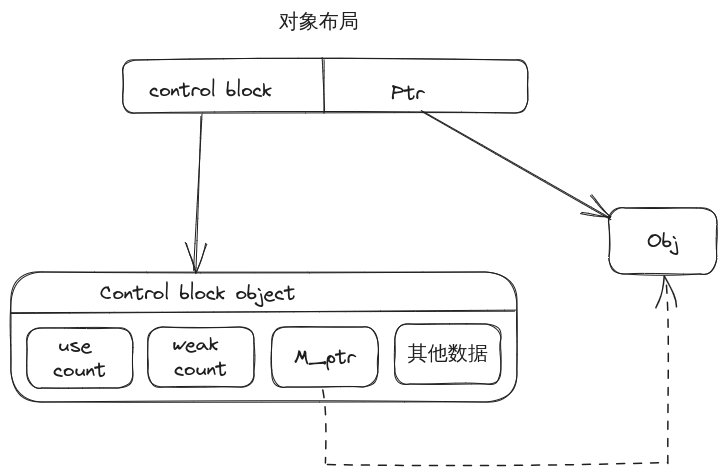

## `shared_ptr`

1. 概念和实现原理

`shared_ptr`是智能指针，采用了RAII的手法，是一个模板对象。表示对某个资源的共享所有权。

2. 对象布局

+ shared_ptr本身包含两个对象：

  + 指向资源对象的指针

  + 指向控制块对象的指针

+ 当采用`std::shared_ptr<T>(new T{})`形式创建时，其控制块对象中会包含一个`M_ptr`的成员，这个指针指向智能指针管理的资源对象。

+ 控制块至少包含`use_count`（引用计数）、`weak_count`（弱引用计数）、和其他数据这三个部分。

+ `make_shared`之使用
  + 当采用`make_shared`创建时，**其控制块对象和被管理资源存放在同一个内存块中**
  + 控制块对象中，不会包含`M_ptr`成员。

### 问题

+ 注意double-free的问题，不要和原始指针搭配使用
+ 注意循环引用的问题，使用weak_ptr解决
