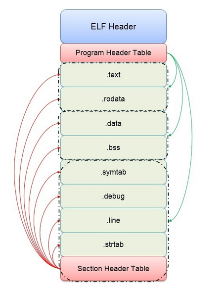

# 符号重定义

符号重定义（Symbol Redefinition）指的是在同一个作用域内**多次定义同名标识符**（包括变量、函数、类等）。符号重定义错误通常包括预处理期符号重定义，编译期符号重定义，链接期符号重定义，以及运行期符号重定义

+ 同名宏
+ 名称冲突
+ 头文件多重包含
+ 链接错误（多个翻译单元出现了相同的符号）
+ 运行期重定义（如动态库链接）

## 机制

c++是单文件编译，在编译时将这些文件单独编译称目标文件，然后通过连接器将它们链接成一个可执行文件。

目标文件格式：

## 解决符号重定义方法

### 命名空间

### 预处理指令

### `static`

可以将变量或函数**限制在当前文件的作用域内**，即使两个目标文件有同名变量，也不会报符号重定义错误。

这是因为，在目标文件ELF符号表中，被 `static` 修饰的变量会被标记为**本地符号** (Local Symbols)，链接器检测到两个或者多个目标文件ELF符号表内有同名符号，若这个符号是本地符号，则认为它们是不同变量

### `inline`

将函数或者变量**声明为内联类型时**，即使两个目标文件有同名变量，也不会报符号重定义错误。

这是因为，在 ELF 符号表中，被inline修饰的函数会被标记为**弱符号**(Weak Symbol)，链接器检测到两个或者多个目标文件ELF符号表内有同名符号，若这个符号是弱符号，则取其中一个符号对应的值。

### `extern`

在一个编译单元中使用 extern关键字来声明一个变量或函数，并在另一个编译单元中定义该变量或函数，这样，在链接时不会发生符号重定义的问题。

这是因为，在 ELF 符号表中，被 extern 声明的符号会被标记**为未定义**，链接器检测到两个或者多个目标文件ELF符号表内有同名符号，**若这些符号只有一个已定义，其余都是未定义**，则认为这些符号共用这一个已定义的值。

### `const`

默认情况下，使用const修饰符可以将变量或函数**限制在当前文件的作用域内**，即使两个目标文件有同名变量，也不会报符号重定义错误。

这是因为，在目标文件ELF 符号表中，默认情况下，被const修饰的变量会被标记为**本地符号** (Local Symbols)，链接器检测到两个或者多个目标文件ELF符号表内有同名符号，若这个符号是本地符号，则认为它们是不同变量。