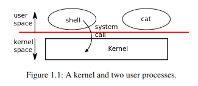

# XV6系统

## 概述

### 课程笔记

操作系统的设计目的：

+ 抽象硬件以方便和移植性
+ 在多个程序之间多路复用硬件
+ 隔离应用程序(程序包含bugs)
+ 允许在合作程序间共享
+ 安全控制共享
+ 不妨碍高性能
+ 支持广泛的应用程序

操作系统的工作是在多个程序之间共享计算机，并提供比硬件本身支持的更有用的一组服务。

系统的组织：**分层**(用户态和内核态)




用户程序：vim, gcc, DB等

内核服务

硬件：CPU, RAM, disk, net等

内核通常提供哪些服务？

+ 进程（正在运行的程序）
+ 内存分配
+ 文件内容
+ 文件名和目录
+ 其他：用户，网络，时间，终端等等

### 读书笔记

操作系统大都采用内核的传统形式向程序提供服务，也就是说，内核是一种为正在运行程序提供服务的特殊程序。

每个进程（正在运行的程序）都包含指令、数据和堆栈的内存。计算机通常有许多个进程，但只有一个内核。当进程需要调用内核服务的时候，它会调用系统调用（看起来向函数的东西），这也是操作系统接口中的调用之一。系统调用进入内核，内核执行服务并返回。因此，进程在用户态和内核态之间交替执行。

#### 进程和内存

进程切换到内核态，其CPU寄存器的状态需要保存，当再次执行时，回去状态。

#### I/O和文件描述符

文件描述符是一个整数，表示进程可以读取或者写入的内核管理对象。

进程可以通过打开文件，目录，设备，创建管道或者复制现有描述符来获取文件描述符。因此，文件描述符抽象化了文件，管道和设备之间的差异，使他们看起来都像字节流。我们将输入输出成为I/O。

+ 0 - 标准输入
+ 1 - 标准输出
+ 2 - 标准错误


重定向IO

```c
argv[0] = "cat";
argv[1] = 0;
if (fork() == 0) {
	close(0);
    open("input.txt", O_RDONLY); // 此时描述符0是指向input.txt文件的。
    exec("cat", argv);
}
```

这里可以看出fork和exec单独调用的妙处是，重定向孩子的I/O而不会干扰主I/O的设置。

`dup`系统调用是赋值现有文件描述符，返回引用相同基础IO对象的新描述符。两个文件描述符**共享一个偏移量**。

#### 管道

管道是作为一对文件描述符，向进程暴露的一段内核缓冲区，一个用于读取，一个用于写入。

## 系统组织

### 读书笔记

操作系统必须满足三个要求：

+ 多路复用
+ 隔离
+ 交互

#### 抽象物理资源

实现强隔离，最好是禁止应用程序直接访问敏感的硬件资源，而是将资源抽象到服务中。如程序通过文件系统的打开，写入，关闭等与存储交互，而不是直接读取和写入磁盘。

#### 几种模式

riscv有三种CPU可以执行指令的模式：机器模式，监督模式和用户模式。每个模式执行的指令权限不同。

用户态程序必须进入内核态才能执行内核态函数。

#### 内核组织

单内核，整个系统都驻留在内核态中，便于所有系统调用都在监督模式下运行。

微内核，最大限度减少在监督模式下运行的操作系统代码另。

## 虚拟内存和页表

### 课程笔记

**问题**：我们假设shell程序有个错误：有时候他会写入随机内存地址，我们如何防止它破坏内核？以及破坏其他进程？

我们想要隔离的地址空间，每个进程都有自己的内存，它只可以读写自己的内存，它不能读写任何其他内容。

挑战：如何在一个物理内存中多路复用多个内存？同时保持内存之间的隔离？

RISC-V映射 4KB的页面并对齐。从4KB边界开始 4KB=12位（偏移量），在64位地址中，64-12=52位，除了前52位中的前25位位使用，后27位作为索引。

+ 页表存储在那里？在RAM中，MMU加载并存储PTE

+ 页表只是PTE数组是否合理？它有多大？

不合理，2^27大约是1.34亿，每个条目64位（8个字节），134 * 8 MB，对于整个页表浪费1个G的内存。每个地址空间一个页表，每个程序有一个地址空间，这样会浪费大量内存给小程序。你可能只需要几百页的映射，而其余条目被浪费掉了。

因此，使用三级页表来节省空间。512 x 512 x 512 PTE条目可能无效，这些PTE页面不需要存在。

+ MMU如何知道页表在RAM中的位置？

`satp`寄存器保存根部的页表物理地址

**间接寻址允许分页硬件解决许多问题，如物理内存不必是连续的，避免碎片，延迟分配（写时复制）**

+ 为什么要在内核中使用虚拟内存？为用户进程使用页表显然是件好事，但为什么要为内核使用页表呢？内核可以仅使用物理地址运行吗？

是的，大多数标准内核确实使用虚拟地址，为什么标准内核这样做？有些原因是蹩脚的，有些更好，没有一个是根本的 - 硬件使其难以关闭，例如在进入系统调用时，必须禁用虚拟机 - 内核本身可以从虚拟地址中受益 标记文本页面 X，但数据不是（帮助跟踪错误） 取消映射内核堆栈下方的页面（帮助跟踪错误） 在用户和内核中映射页面（帮助用户/内核过渡）

### 读书笔记

页表确定内存地址的含义，以及可以访问物理内存中的哪些部分。


虚拟地址到物理地址的转换。页表作为三级树存储在物理内存中。树的根是4096个字节，包含512个PTE的页表页，其中包含页表页的物理地址。在树的下一级，这些页面中的每一个都包含树中最后一个级别的512个PTE。

分页硬件使用27位中的前9位在根页表中选择PTE，中间9位在下一级的页表页中选择PTE，最后用于最后一级的PTE选择。

如果转换地址所需的三个PTE中任何一个不存在，那么分页硬件将引发页面错误异常，由内核处理异常。

#### 内核地址空间

xv6为每个进程维护一个页表，描述每个进程的地址空间，以及一个描述内核地址空间的单页表。

## 陷入和系统调用

### 课程笔记

```bash
preview:
  write()                        write() returns              User
  -----------------------------------------------------------------
  uservec() in trampoline.S      userret() in trampoline.S   Kernel
  usertrap() in trap.c           usertrapret() in trap.c
  syscall() in syscall.c           ^
  sys_write() in sysfile.c      ---|
```

### 读书笔记

有三种类型的事件会导致CPU搁置指令的普通执行，并强制将控制权转移到处理事件的特殊代码。

+ 系统调用，执行`ecall`指令要求内核为其执行某些操作时
+ 指令（用户或内核）执行非法操作，如除零或者使用无效虚拟地址
+ 设备中断，设备发出需要注意信号时，如磁盘读取或者写入请求时

本文将这些情况统称为**陷入**。

一些重要的寄存器：

+ `stvec`：内核在此处写入其陷入处理程序的地址，riscv跳转到stvec中的地址以处理陷入。
+ `sepc`：当陷入发生时，riscv将程序计数器保存在此处（pc的值在后面会被覆盖），sret指令将spec复制到pc中。
+ `scause`：riscv放一个数字在这里，描述陷入的原因。
+ `sscratch`：内核在这放置一个值，该值在陷入处理程序而开头就派上用场了。
+ `sstatus`：sstatus中的SIE位控制是否启用设备中断。如果内核清除SIE, RICSV将推迟设备中断，直到内核设置SIE。

## 中断和设备驱动

### 读书笔记

驱动程序是操作系统管理特定设备的代码（配置硬件，告诉设备执行操作，处理生成的中断）。

xv6允许在内核中和用户程序执行时中断设备和计时器。

中断的CPU开销很高。因此，高速设备（如网络和磁盘控制器）使用减少中断需求的技巧。一个技巧是为整批传入或传出请求引发单个中断。另外一个技巧是让驱动程序完全禁用中断，并定期检查设备以查看是否需要注意（这也被成为轮询）。如果设备操作非常快，则轮询是有意义的，如果设备大部分处于空闲，则浪费CPU。某些程序在轮询和中断间动态切换（取决于当前设备负载）。

## 锁

## 调度

任何操作系统运行的进程都可以多于CPU的数量，因此需要一个计划在进程之间分时CPU。理想情况下，共享对进程是透明的。

## 文件系统

## 并发

