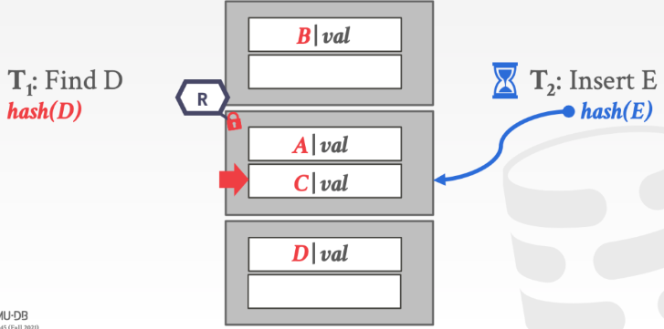

# 并发索引控制

回顾：
+ 前面几节课提到，数据库内部用于存储内部数据的各种数据结构，hash table, B+Tree, Radix Tree等树形结构。这些数据结构建立在我们只有一个线程访问的假设之上，即同一时间只有只一个线程对该数据结构进行读写数据。
+ 大部分的数据库系统不是单线程的，在现实的场景中需要运行多线程并安全地访问数据结构，充分利用CPU多核性能和隐藏磁盘的I/O延迟。（当然也有只支持单线程的，如Redis）。

## 控制协议

有了需要多线程访问数据结构的需求，则需要并发控制协议，它是数据库系统保证并发操作正确性的方法。协议标准如下：

+ 逻辑正确性(logical correctness)
  + 线程读它期望读到的值，如在一个transaction中，一个线程写完一个值之后，再读它，应该还是它之前写的值。
+ 物理正确性(physical correctness)
  + 共享对象内部表示是安全的，比如共享对象内部指针不能指向非法物理位置。

## 锁（Lock）与锁（Latch）的区别

在数据库系统中，有两种锁的概念。

1. Lock是一种high-level的概念，它避免不同transaction的竞争，比如对数据库，表，元组的lock。transaction在它整个生命周期中持有lock。lock可以回滚。（我称这种为事务锁，因为他是语义层面的，比如两阶段提交锁）

2. Latch（和OS中的锁一样），是一种low-level的概率，其本质就是一种防止数据竞争的保护原语。它用于数据库系统中其内部数据结构的临界区。在执行操作的时候持有。latch不支持回滚。（我称这种为数据锁，因为它就是程序层面对共享数据的保护，主要为了线程安全，如常见的互斥量）

## Latch的实现

基本原理是通过现代CPU硬件提供原子指令的支持所实现，如CAS(compare-and-swap)。
数据库系统实现了几种latch方法，每种方法都有不同的权衡。（在工程上，没有针对所有问题的完美解法，有的是在复杂性和性能之间的不同权衡）

1. Blocking OS Mutex
    + 使用OS的内置互斥量。如Linux提供了Futex。
    + `std::mutex`
    + 优点：简单。
    + 缺点：开销大。不可扩展。依赖OS调度。

2. TAS
   + 由DBMS控制的自旋锁，这种方式给了DBMS更多控制权。
   + `std::atomic<T>`
   + 优点：高效，单一指令。
   + 缺点：不具扩展性，也不适合缓存。浪费CPU。

3. 读写Latch
  + `std::share_mutex`
  + 优点：并发读
  + 缺点：需要维护读写队列，内存开销大。

总结：
（1）使用互斥原语，如大多数语言都提供了线程库
（2）使用原子指令，这主要依赖于CPU的硬件。
（3）结合上面两种方式，划分锁的粒度，分离读写操作。

## 哈希表中的锁

静态哈希表比较好加锁，进行查找的线程都是从上到下查找，从上到下地获取slot的锁，不会出现死锁情况。如果要调整哈希表大小，则对整个哈希表上一把大锁就行。

动态哈希表（如可扩展哈希）加锁更复杂，因为有更多共享状态，更难进行并发控制。

一般加锁的方式有两种：

+ Page Latch: 对每一个page上读写锁，线程访问页之前上锁，但会降低并行性能。
+ Slot Latch: 对每个slot上读写锁，增加并行性，但同时增加了内存和计算开销（因为线程访问每一个slot都获取锁）。

示例：

对page加锁，一个线程获取到锁，访问page之后，如果另外一个线程同时要加写锁，那么这个线程就会阻塞。

对slot加锁，减小锁的粒度。多个线程可以同时访问一个page，但在访问具体的slot时需要加锁。

## B+树中的锁

B+树的线程安全保证比较复杂。首先考虑以下问题：

+ 多线程在同一个时刻去修改B+树的同一个节点
+ 一个线程在遍历B+树，另外一个线程在直线split/merge操作

### B+树线程安全问题示例
线程T1要删除节点44，它会从根节点往下进行查找，沿着链路找到位于叶子节点的44，然后删除。

删除44之后，触发了叶结点的borrow，且此时T2线程正要读取节点41。在没有任何并发安全保证的情况下，虽然41存在，但T2可能拿不到数据，因为此时T1因为borrow将41移动开了。
这就造成了数据的不一致。

### Latch Crabbing && Coupling

这是一种保证B+并发安全的方式。

Crabbing基本思想：**线程在遍历时，先获取parent的latch，再获取child的latch，如果孩子是"安全"(节点再操作后不会促发split或者merge，从而影响父节点)的，那么释放parent的latch。**

+ 插入元素，节点未满
+ 删除元素，节点超过半满
+ 搜索元素，所有节点都是“安全”节点

基本Crabbling协议：
+ Search: 从根往下，重复获取节点读锁，并释放父节点的读锁
+ Insert/Delete: 从根往下，对子节点加写锁，进一步判断子节点是否“安全”，如果安全则全部释放所有祖先节点的写锁。

这个算法存在的一些问题：（1）事务在每次插入/删除的时候，总是从根上获取写锁，限制了并行的性能。（2）这是一种悲观的策略，因为我们假设了每次操作都涉及到了split/merge的行为。实际上，大多数情况下都不会发生这两种行为。因此可以用乐观的策略来优化加锁过程。

针对上面问题的优化：

+ Search: 和基本方案一样
+ Insert/Delete: 搜索root到leaf的过程中加读锁，最后对leaf加写锁。然后判断叶节点是否”安全“。如果安全，那么操作成功，如果不安全，那么释放写锁，用悲观的策略重新执行这个操作（和基本方案一样）。

### Leaf Node Scans

上述的方案都是至上而下的。这意味着线程只能从低于当前节点中获取锁，如果想要的锁不能用，那么线程必须等待，知道可用。（这样永远不会有死锁）

叶子节点的扫描是可能出现死锁的，因为线程可能**从两个不同方向**获取写锁。

T1写锁，T2读锁。此时两个线程都无法获取到另外一个page的锁，T2的方法有以下几种：

1. T2主动释放锁，并从头开始
2. T1让T1放弃，T2获得pageC的锁，让T1重新开始
3. T2等待一段时间，在timeout后释放锁并重新开始

常用的方式是第一种，这是一种”无等待模式“。如果尝试获取叶节点的兄弟节点的锁，如果不可用，那么中止操作，并重新开始。

### Delayed Parent Updates

我们观察到，每次叶节点溢出时（这也意味着这种策略只有在插入时使用），我们都要更新至少三个节点：
+ 拆分的叶节点
+ 新的叶节点
+ 父亲节点

修改成本高，Blink-Tree提出了一种优化策略：每当叶子节点溢出时，只是标记，暂时不更新parent node， 等下一次有别的线程获取parent node 的写锁时一并修改。