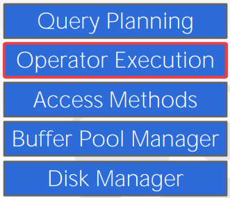
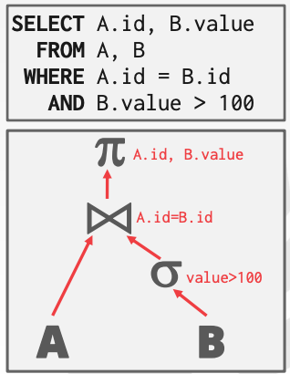
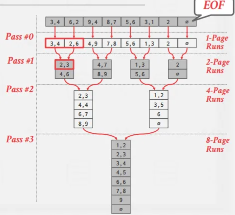

# 排序和聚合算法
查询的处理过程可以由下图简单概述：

需要注意的是，数据库系统**查询的中间结果**也需要存到磁盘中。因此，我们所讨论的算法也是基于Disk的。

什么是query plan?

+ **算子**组织成树形结构，**数据**从叶子向根流动，根节点的输入就是查询结果。

## 排序

关系模型是无序的（tuple不会预先排序）。

哪些算子涉及到排序？

+ `ORDER BY`
+ `DISTINCT`
+ `GROUP BY`
+ `JOIN`

数据在内存中放不放得下得问题：
（1）如果放得下，那么可以使用标准得排序算法（如快排）。
（2）如果放不下，那么需要外部排序(external sorting)，根据需要溢出到磁盘

如果查询包含 `ORDER BY` 和 `LIMIT` 语句，这就表明 DBMS 只需要扫描一次数据就可以找到前 N 个元素。这就是所谓的 **Top-N Heap Sort**。

堆排序的**理想场景是 top-N 元素能存到内存中**，这样 DBMS 只需维护一个内存中的堆排序优先队列即可。

### External Merge Sort

外部归并排序是一个**分治**排序算法，将数据分割成一些独立的 runs (一个 run 是指一系列 key/value pairs) ，单独地对它们进行排序，接着将它们组合成一个更长的 runs 。可以**将 runs 存到磁盘中，并在需要的时候读回来**。

两个阶段：

+ Sorting: 将能放进内存中的小块数据进行排序，并将排序好的数据写回磁盘
+ Merge: 将两个 (可能是多个，两个的叫做 two-way) 排好序的子文件合并成一个大文件

#### Two-way Merge Sort

该算法在 Sorting 阶段读取每个页面，对其进行排序，并将排序后的版本写回磁盘。然后，在 Merge 阶段，它使用 3 个缓冲页。它从磁盘中读取两个排序的页面，并将它们合并到第三个缓冲区页面中。每当第三页填满时，它就会被写回磁盘并替换为空页。每组排序的页面称为一个 run。然后，算法递归地将 runs 合并在一起。

如下图，一开始一共有 8 个页, 每个页是一个独立的 run，然后第一次遍历，也就是 pass0，先将每一个 run 都排好序；第二次遍历中，每次读取进两个相邻的长度为 2 的 run，然后进行合并，输出长度为 4 的排好序的 run（被放置在 2 个页中）；第三次遍历中，每次读取相邻两个长度为 4 的 run，然后进行合并，输出长度为 8 的排好序的 run（放置在 4 个页中）；第四次遍历中，将两个长度为 8 的run合并，最终生成长度为 16 的run（放置在 8 个页中），算法结束。

如果 N 是数据页的总数，该算法在数据中一共要进行 $1+⌈log_2N⌉$次pass (1表示第一步先将所有页内的都排好序，即pass#0。$log_2N$是合并过程中迭代的次数)。

一次pass可以理解为对数据的一次遍历。

因此，我们可以简单算出I/O的花费是$2N \times (pass \ num)$，每个pass对页面都有一个读和写，所以有个2。

####  General (K-way) Merge Sort

K-way相对于2路来说，可以使用3个以上的缓冲页。

> 用 B 表示可用缓冲页数量, 在排序阶段，缓冲区可以一次性读 B 个页面，并将 $\lceil \frac{N}{B} \rceil$ 个排好序的runs写会磁盘，每次可以将 B-1 个runs结合到一起，使用另外一个缓冲页排序，写回磁盘。

算法一共需要遍历数据 $1+ \lceil log_{B−1}{\frac{N}{B}} \rceil$ 次 ，总 I/O 花费 2N * 
(# 𝑜𝑓 𝑝𝑎𝑠𝑠)。

#### 双缓冲优化

在后台预获取下一个 run，并在系统处理当前 run 时，将其存储在第二个缓冲区中。这样通过**连续使用磁盘减少了每一步I/O请求的等待时间**。如在处理 page1 中的 run 时，同时把 page2 中的 run 放进内存。

### 使用B+树

如果我们**要进行排序的属性**，正好**有一个构建好的B+树索引**，那么可以直接使用B+树排序，而不是用外排序。

+ **聚簇B+树**：可以直接找到最左的叶子节点，然后遍历叶子节点，这样总比外排序好，因为没有计算消耗，所有的磁盘访问都是连续的，而且时间复杂度更低。
+ **非聚簇B+树**：遍历树总是更坏的，因为每个 record 可能在不同的页中，所有几乎每一个 record 访问都需要磁盘读取。

## 聚合

聚合算子是将多个元组的单个属性的值计算成为单个标量值。比如求和，求平均等。

实现聚合的两种方法：

+ 排序
+ 哈希

### 排序聚合

