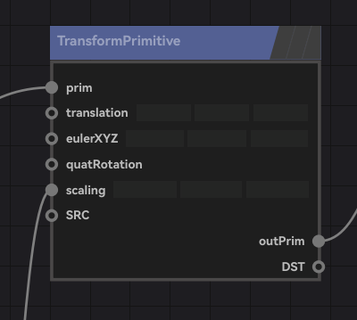
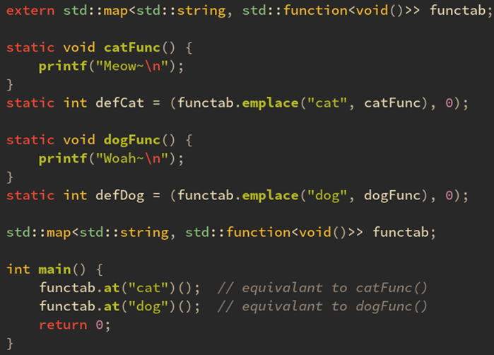
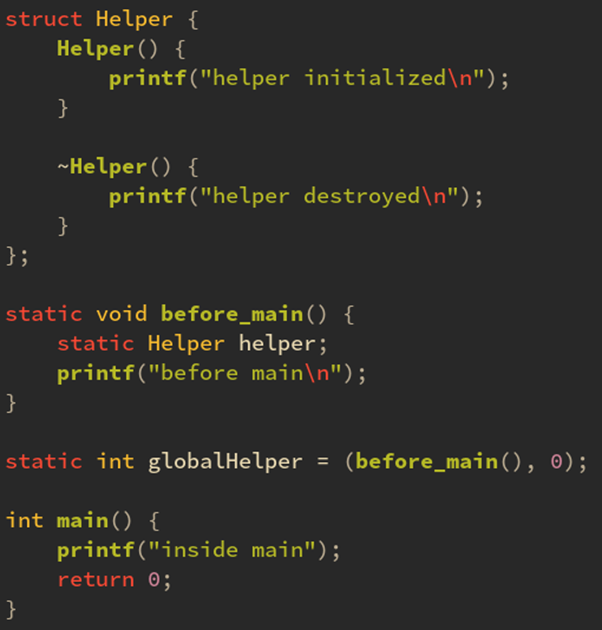
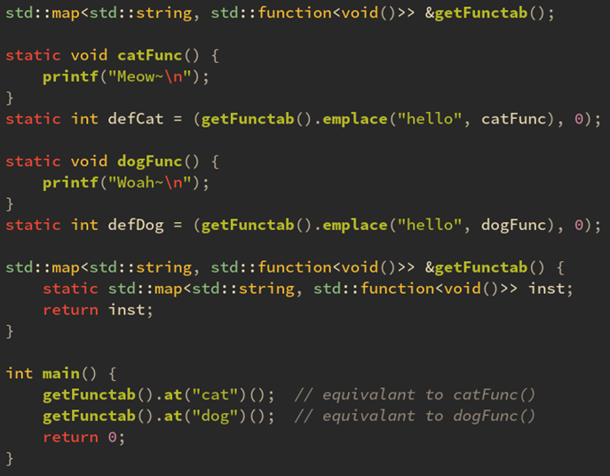

# Zeno中的设计模式

> [课程链接](https://www.bilibili.com/video/BV1r14y167w2)
## Zeno中的基本类型

+ IObject 一切对象的公共基类
+ INode 一切节点的公共基类

## 多态的经典案例

```c++
struct IObject {
    IObject() = default;
    IObject(const IObject &) = default;
    IObject &operator=(const IObject &) = default;
    virtual ~IObject() = default;

    virtual void eatFood() const = 0; 
};

struct Cat: IObject {

    std::string m_catfood = "Fish!";
    virtual void eatFood() const override {
        std::cout << "Eating " << m_catfood << std::endl;
    } 
    virtual ~Cat() override = default;
};

struct Dog: IObject {
    std::string m_dogfood = "Bones!";
    virtual void eatFood() const override {
        std::cout << "Eating " << m_dogfood << std::endl;
    }
    virtual ~Dog() override = default;
};
```
+ IObject具有一个`eatFood`纯虚函数，其他两个类继承IObject，他们各自实现`eatFood`这个虚函数的行为，从而实现多态。

+ 这里要注意析构函数需要是虚函数。否则，以`IObject *`指针在delete释放的时候只会释放IObject里的成员，而不会释放继承他的对象中的成员，造成内存泄漏。所以，这里的解构函数也是多态的，它根据派生类型的不同调用不同的解构函数。

### 多态用于设计模式之“模板模式”

我们有一个任务是对`eatFood`做文章，比如重复吃两遍。

```c++
void eatTwice(IObject *obj) {
    obj->eatFood();
    obj->eatFood();
}

int main()
{
    std::shared_ptr<Cat> cat = std::make_shared<Cat>();
    auto dog = std::make_shared<Dog>();

    eatTwice(cat.get());
    eatTwice(dog.get());

    return 0;
}
```

+ 我们可以封装到一个`eatTwice`函数中，这个函数只需要接受他们共同的基类，然后调用`eatFood`这个虚函数来做事（而不是具体操作Cat, Dog对象本身）

+ 这样写一边，就可以对cat, dog都适用，实现了代码的复用(Don't repeat youself)。

> Tip: `shared_ptr` 如何深拷贝？
> 
> + 浅拷贝
> ``` c++
> {
>   std::shared_ptr<int> p1 = std::make_shared<int>(42);
>   std::shared_ptr<int> p2 = p1; 
>   *p1 = 233;
>   std::cout << *p2 << '\n';
> }
> ```
> + 深拷贝
> 
> ```c++
>{
>    std::shared_ptr<int> p1 = std::make_shared<int>(42);
>    std::shared_ptr<int> p2 = std::make_shared<int>(*p1);
>    *p1 = 233;
>    std::cout << *p2 << '\n';
> }
> ```

### 思考？能把拷贝构造函数也作为虚函数吗？

+ 现在我们的需求有变化，不是去对同一个对象调用两次`eatTwice`，而是先把对象复制一份拷贝，然后对对象本省和他的拷贝都调用一次`eatFood`。

```c++
{
    auto cat = std::make_shared<Cat>();
    auto dog = std::make_shared<Dog>();
    
    auto new_cat = std::make_shared<Cat>(*cat);
    cat->eatFood();
    new_cat->eatFood();

    auto new_dog = std::make_shared<Dog>(*dog);
    dog->eatFood();
    new_dog->eatFood();
}
```
上面代码要如何封装呢？你可能回想，是不是可以把拷贝构造函数也声明为虚函数呢，这样不就可以实现多态了吗？答案是不行的，因为c++规定"构造函数不能是虚函数"(对象构建时，虚函数表的设置在构造函数执行时（或者之前）完成的，对象都没构造完，如何正确确定指针地址？)

**模板函数？有些差强人意**

```c++
template <class SomeObject>
void eatTwice(SomeObject *obj) {
    std::shared_ptr<SomeObject> new_obj = std::make_shared<SomeObject>(*obj);
    obj->eatFood();
    new_obj->eatFood();
}
```
把`eatTwice`声明为模板函数的确能解决问题，但模板函数不是面向对象的思路，并且如果cat和dog是在一个IObject指针里就会编译报错，如`vector<IObject*>`

**正确解法：额外定义一个clone作为纯虚函数，然后让不同类别各自实现它**

```c++
// IObject中
virtual std::shared_ptr<IObject> clone() const = 0;

// Cat中
virtual std::shared_ptr<IObject> clone() const override {
  return std::make_shared<Cat>(*this);
}

// Dog中
virtual std::shared_ptr<IObject> clone() const override {
  return std::make_shared<Dog>(*this);
}

// eatTwice函数实现封装
void eatTwice(Object *obj) {
  auto new_ojb = obj->clone();
  obj->eatFood();
  new_obj->eatFood();
}
```
+ 调用`clone`就等价于调用了dog或者cat的`make_shared<xx>(*obj)`，这就实现了**拷贝多态**。

### 如何批量定义`clone`函数？

#### 使用宏

+ 可以使用宏`IOBJECT_DEFINE_CLONE`,其内容是clone的实现。
```c++
#define IOBJECT_DEFINE_CLONE \
  virtual std::shared_ptr<IObject> clone() cosnt override { \
    return std::make_shared<std::decay_t<decltype(*this)>>(*this);
  }
```
+ 宏的缺点是不遵守命名空间的规则，它的名字是全局可见的，不符合c++的封装思想。


#### 另外一种写法（使用模板类）
```c++
template <class Derived>
struct IObjectClone: IObject {
    virtual std::shared_ptr<IObject> clone() const override {
        const Derived *that = static_cast<const Derived *>(this);
        return std::make_shared<Derived>(*that);
    }
};

struct Cat: IObjectClone<Cat> {

    std::string m_catfood = "Fish!";
    virtual void eatFood()  override {
        std::cout << "Eating " << m_catfood << std::endl;
        m_catfood = "Bone...";
    }

    virtual ~Cat() override = default;
};


struct Dog: IObjectClone<Dog> {
    std::string m_dogfood = "Meat!";
    virtual void eatFood()  override {
        std::cout << "Eating " << m_dogfood << std::endl;
        m_dogfood = "Bone...";
    }

    virtual ~Dog() override = default;
};

```
+ 定义一个IObjectClone模板类。**其模板参数是他的派生类**。
+ 在这个IObjectClone中实现clone即可。
+ 这里注意`make_shared`的参数有Derived, `this`指针 (原本是IObjectClone const *类型) 也需要转化成Derived的指针才能调用Derived的拷贝构造函数。

### 奇异递归模板模式（Curiously Recurring Template Pattern，CRTP）

+ 形如 `struct Derived: Base<Derived> {};`
+ 基类模板参数包含派生类型，这种就是CRTP。包含派生类型是为了能调用派生类的某些函数（我们这个例子中是拷贝构造函数）。
+ 我们的目的是让基类能调用派生类的函数，其实本可以通过虚函数的。但是：
  + 虚函数是运行时确定的，有一定性能损失
  + 拷贝构造函数不能作为虚函数
+ 这构成了CRTP的两大常见用法：
    1. 更高性能地实现多态
    2. 伺候一些无法定义为虚函数的函数，比如拷贝构造，拷贝赋值等。

#### CRTP的一个注意点：如果派生类是模板类

+ 如果派生类Derived是一个模板类，则CRTP的那个参数应该包含派生类的模板参数。

```c++
template <class T>
struct Derived: Base<Derived<T>> {};
```
#### CRTP的改进：如果基类还想基于另外一个类

现在我们的需求要新增一个”SuperDog"类，他继承自Dog。

+ 这时我们可以给IObjectClone新加一个模板参数Base, 其默认值为IObject。
+ 当用户需要的时候就可以指定第二个参数Base, 从而控制IObjectClone的基类，也就相当于自己继承于那个Base类，不指定的话就默认IObject。
  
```c++
template <class Derived, class Base=IObject>
struct IObjectClone: Base {
    virtual std::shared_ptr<IObject> clone() const override {
        const Derived *that = static_cast<const Derived *>(this);
        return std::make_shared<Derived>(*that);
    }
};

struct SuperDog: IObjectClone<SuperDog, Dog> {
    virtual void eatFood() override {
        Dog::eatFood();
        std::cout << "I am super Dog.\n";
    }
};
```


## 类型擦除

Zeno中对OpenVDB对象的封装
+ 开源的体积数据处理库OpenVDB有许多“网格”类
+ 我们并不知道他们之间的继承关系，可能有，可能没有。但是在Zeno中，我们必须有。
+ 他们还有一些成员函数，这些函数可能是虚函数，也可能不是。
+ 如何在不知道OpenVDB每个类具体继承关系的情况下，实现我们想要的继承关系，从而实现代码封装和代码重用？

以上便是我们使用**类型擦除**的动机。

### 依然以猫和狗为例

故事开头：
如下有猫和狗类，假如这两个类时第三方库写死的，这个三方库作者可能没学过《面向对象程序设计》，居然没有定义一个公用Animal基类并设置一个speak为虚函数。你现在抱怨没用，因为这个库是按照LGPL协议开源的，你只能链接他，不能修改他的源码，但是你的老板要求你把speak变成一个虚函数！那怎么办呀，难道你只好准备递交辞呈了？

```c++
struct Cat {
    void speak() const {
        printf("Meow~\n");
    }
};

struct Dog {
    void speak() const {
        printf("Woah!\n");
    }
};

```
+ 你依然可以定义一个Animal接口，其具有一个纯虚函数speak。然后定义一个模板类AnimalWarpper，他的模板参数Inner则是用来闯将他的一个成员m_inner。
+ 然后，给AnimalWarpper实现speak为原封不动去调用`m_inner.speak()`
+ 这样一来，你以后创建猫和狗对象的时候只需要绕个弯，用`new AnimalWarpper<Cat>`创建就行了，或者`using WarppedCat = AnimalWrapper<Cat>`
+ 就这样，我们根本不用修改Cat和Dog的定义，就能随意地把speak封装为多态的虚函数。**只要语义上一样(也就是函数名字一样)，就可以用这个办法随意转换任意依赖于操作为虚函数。**
+ 实际上`std::any`也是一个类型擦除的容器
  

### 类型擦除利用的是C++模板的惰性实例化

由于 C++ 模板惰性编译的特性，这个擦除掉的表达式会在你实例化 AnimalWrapper<T> 的时候自动对 T 进行编译。这意味着如果你给他一个不具有一个名为 speak 成员函数的类（比如这里的 Phone 类只有 play 函数）就会在实例化的那行出错。

## Zeno中的节点系统

+ 节点在 Zeno 中所扮演的角色，实际上相当于函数式编程中的函数。

+ 节点输入若干个对象，并输出若干个对象。

+ 节点的输出可以连线到另一个节点的输入上，相当于函数的调用和返回。

+ 众多节点的组合，可以形成更强大的功能，这就是 Zeno 的 dataflow-programming。




### main函数真的是第一个执行的函数？

+ 总所周知，`main`函数是c/c++程序中第一个执行的函数，是程序的入口点？但他真的是第一个执行吗？
+ 答案：不是的

#### 全局变量初始化的妙用

+ 我们可以定义一个int类型全局变量，然后在它右边其实可以写一个表达式，这个表达式实际上会**在`main`函数之前执行！**
+ 全局变量的初始化会在main之前执行，这是C++标准中的一部分，我们完全可以放心利用这一点来执行任意表达式。


#### 逗号表达式的妙用

+ 逗号表达式的特性，总是会返回后一个值，例如 (x, y) 始终会返回 y，哪怕 x 是 void 也没关系。
+ `static int heper = (任意表达式，0)`

### 带有构造函数和解构函数的类

```c++
struct Helper {
    Helper() {
        printf("before main\n");
    }
    ~Helper() {
        printf("after main\n");
    }
};

static Helper helper;

int main()
{
    printf("inside main\n");
    return 0;
}
```

+ 定义一个带有构造函数和解构函数的类（Helper），然后声明该类的全局变量，就可以保证
    1. 该类的构造函数一定在main之前执行
    2. 该类的解构函数一定在main之后执行
+ 该技巧可用于程序在退出时删除某些文件之类。
+ 这就是**静态初始化（static-init）大法**

#### 静态初始化用于批量注册函数

+ 我们可以定义一个全局的函数表，利用静态初始化大法，把这些函数在main之前就插入大全局的函数表。
+ 这样main中就可以仅通过函数名从functab中访问到它们。

```c++
#include <bits/stdc++.h>
static std::map<std::string, std::function<void()>> functab;

static void catFunc() {
    printf("Meow~\n");
}

static void dogFunc() {
    printf("Woah!\n");
}

static int defDog = (functab.emplace("dog", dogFunc), 0);
static int defCat = (functab.emplace("cat", catFunc), 0);

int main()
{
    functab.at("cat")();
    functab.at("dog")();
    return 0;
}
```

#### 静态初始化的顺序是符号定义的顺序决定的，若在不同问年则顺序可能打乱。

+ 如下代码可能会出现sefault！
+ 如果 functab 所在的 main.o 文件在链接中是处于 cat.o 和 dog.o 后面的话，那么 cat.o 和 dog.o 的静态初始化就会先被调用，这时候 functab 的 map 还没有初始化（map 的构造函数也是静态初始化！）从而会调用未初始化的 map 对象导致奔溃
+ 


### 试试函数体内的静态初始化

+ 众所周知，函数体内声明为 static 的变量即使函数退出后依然存在
+ 实际上函数的 static 变量也可以指定初始化表达式，**这个表达式会在第一次进入函数时执行**。注意：是第一次进入的时候执行而不是单纯的在 main 函数之前执行哦！


#### 如果函数体内的static变量是一个类呢？

1. 构造函数会在第一次进入函数的时候调用。
2. 解构函数依然会在 main 退出的时候调用。
3. 如果从未进入过函数（构造函数从未调用过）则 main 退出时也不会调用解构函数。


这就是**函数静态初始化(func-static-init)大法**

> **函数静态初始化可用于“懒汉单例模式"**

#### 函数静态初始化和全局静态初始化的配合

+ 如果在全局静态初始化（before_main）里使用了函数静态初始化（Helper）会怎样？
+ 会让函数静态初始化（Helper）执行得比全局静态初始化（before_main）还早！




+ 我们意识到可以把 functab 用所谓的“懒汉单例模式”包装成一个 getFunctab() 函数，里面的 inst 变量会在第一次进入的时候初始化。因为第一次调用是在 defCat 中，从而保证是在所有 emplace 之前就初始化过，因此不会有 segfault 的问题了！

